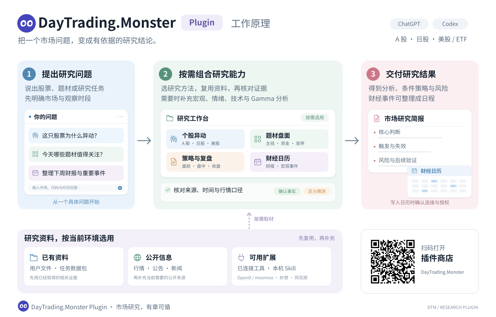

<div align="center">

<h1> DayTrading.Monster <code>Plugin</code></h1>

<p><strong>把一个市场问题，变成有依据的研究结论。</strong></p>

<p>面向 ChatGPT Web、ChatGPT 工作与 Codex 的市场研究插件<br>从个股异动、题材与技术分析，到条件策略、市场复盘和财经日历。</p>

<p><code>A 股</code> · <code>日股</code> · <code>美股 / ETF</code> · <code>10 项研究 Skill</code></p>

<p>
<a href="https://chatgpt.com/plugins/plugins_6aa415f8252481919a6ac03e2072381b">插件商店</a> ·
<a href="#工作原理">工作原理</a> ·
<a href="#快速开始">快速开始</a> ·
<a href="#研究方法">研究方法</a> ·
<a href="docs/MAINTENANCE.md">维护与发布</a>
</p>

</div>

---

**提问题、选方法、找证据、给结论。** DayTrading.Monster Plugin 把常用市场研究流程组织成十项可组合的 Skill。你描述研究目标，插件按需选择方法，先复用已有资料，再补充当前环境可用的证据。

这里保存 **DayTrading.Monster Plugin** 的现行维护源码。插件版与仓库根 `skills/` 的独立 Codex Skill 版允许有入口和运行适配差异，共用的研究长文由构建器从同仓权威来源收集。插件面向 ChatGPT Web、ChatGPT 工作及 Codex，实际能力按当轮环境发现。

希望一次获得十项研究能力，可安装上方商店插件；需要独立 Codex 工作流与本机脚本，可按[仓库安装说明](../README.md)选择单项 Skill。通常不必重复安装同名能力。

## 工作原理

[](docs/assets/how-it-works.zh-CN.svg)

已有资料、公开信息与可用扩展，汇入同一套研究流程。点击图片查看可缩放矢量版；二维码直达插件商店。

## 可以用来做什么

| 研究方向 | 重点看什么 | 得到什么 |
| --- | --- | --- |
| **解释个股异动** | 量价、财报指引、公司公告、行业联动与市场预期 | 区分确认催化、市场猜测和背景噪音 |
| **追踪题材与盘面** | A 股题材强弱、资金流、涨停结构、市场宽度与调研 | 主线、分化、情绪阶段与反证 |
| **形成策略与复盘** | 宏观背景、技术结构、盘前条件、盘中兑现与收盘结果 | 核心判断、触发／失效条件和后续验证 |
| **整理财经日历** | 美日财报、中美日宏观事件、原时区与目标时区 | 可核验的日程；连接可用且获授权时写入 Google Calendar |

需要深入时，再组合**宏观、情绪、技术与 Gamma** 等分析方法，而不是每次把所有能力都跑一遍。

## 快速开始

在已加载 DayTrading.Monster Plugin 的 ChatGPT 或 Codex 环境中，直接描述你的问题即可。把**市场、代码和时间范围**说清楚，更容易得到贴合场景的结果。

### 看懂一次异动

```text
分析 7203 今天为什么异动。
区分公司公告、行业联动和市场猜测，并给出下一步需要验证的信号。
```

### 做一份市场复盘

```text
整理今天 A 股收盘复盘。
先使用我提供的资料，再补充必要证据；重点看主线、分化、明天的触发条件和风险。
```

### 把事件放进日历

```text
整理下周美日财报与重要宏观事件，统一换算为日本时间。
确认来源和重复事件后，把选定事件加入我的 Google Calendar。
```

日历写入前会检查当前连接、用户授权与重复事件，并在写入后回读确认；暂时不能写入时，先交付可用日程表。

## 资料从哪里来

**先复用，再补充；按缺口选来源。** 同一套方法可以在不同环境中工作，实际能用什么，取决于本轮已加载且可调用的能力。

| 资料层 | 使用方式 |
| --- | --- |
| **已有资料** | 优先复用用户文件、任务数据包和本轮已经取得的相关证据，避免重复采集 |
| **公开信息** | 按需读取行情、公司披露、新闻与宏观事件；核对正文、市场日期、时区和数据口径 |
| **可用扩展** | 有需要时发现并调用已安装、已连接且有权限的 Skill 或工具，例如 OpenD / moomoo、妙想或同花顺 |

扩展能力可用时用于补足证据，缺少时继续公开资料流程。**插件提供研究方法，数据与权限由当前环境提供**；它本身不新增行情 API，也不自动安装依赖或修改账户配置。

更多细节见[环境能力路由](skills/market-daily-strategist/references/runtime-capabilities.md)。Gamma 分析按实际取得的公开资料、用户数据或可用期权链开展，完整 GEX 计算以必要输入和实际计算能力齐备为前提。

包内附有六个 Python 脚本，支持日股资料与排名采集、掲示板离线筛选、财报日历、新闻时效检查和期权情景计算。能上传或读取脚本不等于当前对话能执行或联网；插件按实际能力选择路径，详见[掲示板执行说明](skills/jp-stock-move-reason/references/python-execution.md)。

## 研究方法

十项 Skill 按问题组合。先选最贴近目标的入口，再补充需要的分析视角。

<details>
<summary><strong>展开十项研究方法与源码入口</strong></summary>

| 方法 | 适合的问题 | Skill |
| --- | --- | --- |
| A 股异动 | 为什么大涨、大跌、涨跌停或炸板？ | [`cn-stock-move-reason`](skills/cn-stock-move-reason/SKILL.md) |
| 日股异动 | 财报反应、公司披露或 PTS 异动由什么驱动？ | [`jp-stock-move-reason`](skills/jp-stock-move-reason/SKILL.md) |
| 美股 / ETF 异动 | 财报指引、公司事件还是行业联动？ | [`us-stock-move-reason`](skills/us-stock-move-reason/SKILL.md) |
| A 股盘面 | 哪些题材在扩散，资金和涨停结构如何？ | [`cn-market-tape`](skills/cn-market-tape/SKILL.md) |
| 宏观背景 | 利率、汇率、商品与宏观新闻如何影响市场？ | [`macro-news-check`](skills/macro-news-check/SKILL.md) |
| 情绪周期 | 主线、市场宽度、拥挤度与预期差如何？ | [`stock-sentiment-analysis`](skills/stock-sentiment-analysis/SKILL.md) |
| 技术结构 | 趋势、支撑压力、量价和突破回踩如何？ | [`stock-technical-analysis`](skills/stock-technical-analysis/SKILL.md) |
| 期权 Gamma | 已取得的期权结构提示了哪些关键位与情景？ | [`us-stock-gamma-moomoo`](skills/us-stock-gamma-moomoo/SKILL.md) |
| 策略与复盘 | 如何形成盘前、盘中、收盘或长线条件策略？ | [`market-daily-strategist`](skills/market-daily-strategist/SKILL.md) |
| 财经日历 | 如何核验、去重、换算时区并整理事件？ | [`market-calendar-google`](skills/market-calendar-google/SKILL.md) |

</details>

## 让结论有据可查

研究结果同时交代**依据、条件和下一步**：哪些是已确认的事实，哪些仍是市场解释；什么条件支持判断，什么变化会使判断失效；当前还有哪些数据需要补齐。

资料会核对标的、市场、日期、时区、延迟与覆盖范围。数据不足时保留具体缺口，不用猜测补成完整行情。研究与执行分开，报告结论不等于已经下单；写入日历或其他外部操作遵循各自连接与授权范围。

<details>
<summary><strong>与 Scheduled Tasks 配合时</strong></summary>

定时任务以当轮实际可见的能力为准。普通对话或 Codex 中可使用插件，不代表 Scheduled Tasks 已加载；现有维护记录将该项标为待验收。

任务自身的调度、输出、归档、模拟账本与授权合同保持优先。插件提供研究方法，不修改任务或自身规则。

</details>

## 版本与维护

当前源码版本 **0.1.10**，补齐十项 Skill 的来源顺序、研究细则和参考文件，附带便携 Python 与完整掲示板筛选流程，并保留按实际环境发现工具的能力路由。商店发布状态见[兼容与发布状态](../docs/plugin-compatibility.md)；GitHub 更新不会自动更新商店或已安装缓存。

[维护与构建](docs/MAINTENANCE.md)说明插件与独立 Skill 的差异、共享参考和检查步骤。插件不自带行情权限，也不因运行环境缺某项工具而省略可以依据已有资料完成的研究。

---

<p align="center">
<a href="https://chatgpt.com/plugins/plugins_6aa415f8252481919a6ac03e2072381b">插件商店</a> ·
<a href="https://github.com/tsetsugekka/codex-market-skills">源码项目</a> ·
<a href="https://github.com/tsetsugekka/codex-market-skills/blob/main/docs/plugin-privacy.md">隐私政策</a> ·
<a href="https://github.com/tsetsugekka/codex-market-skills/blob/main/docs/plugin-terms.md">使用条款</a>
</p>
